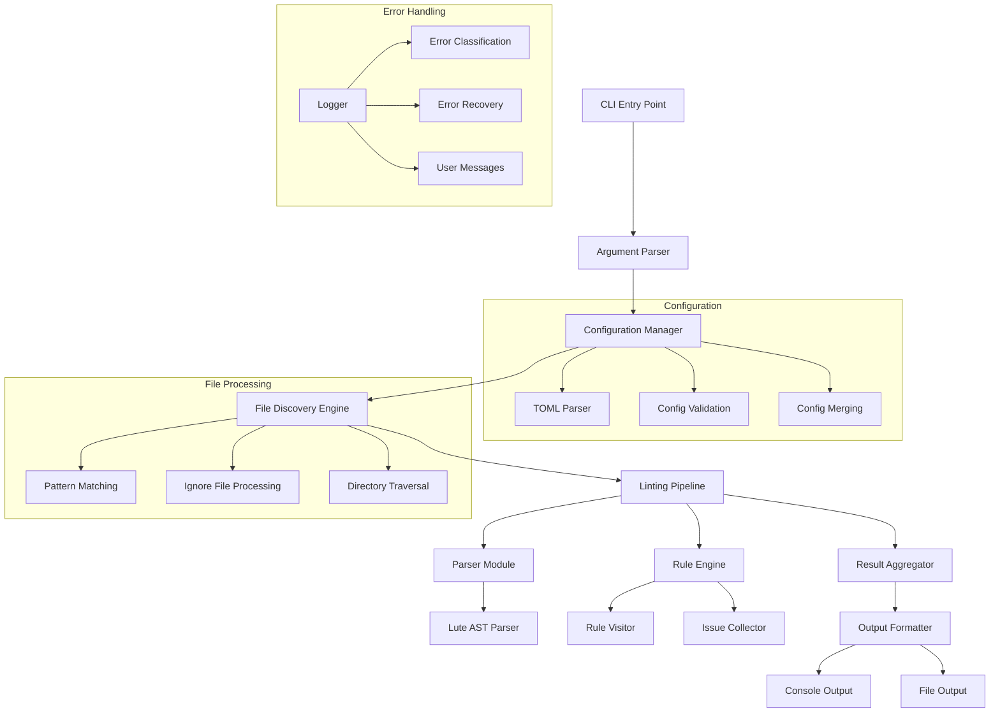
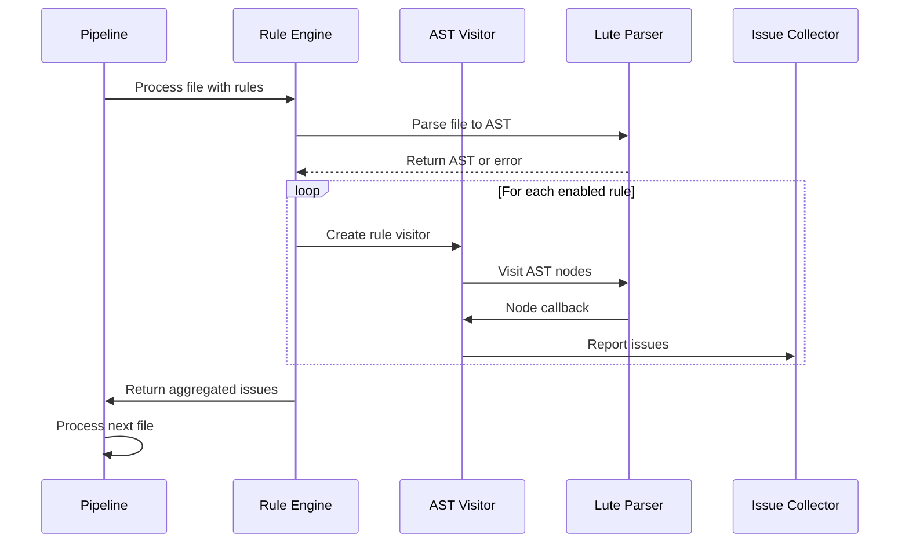
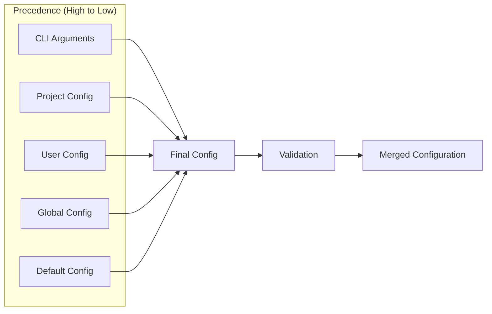

# Core Architecture Design - Luau Linter

## Table of Contents
1. [Architecture Overview](#architecture-overview)
2. [Main Entry Point and CLI Structure](#main-entry-point-and-cli-structure)
3. [Configuration System](#configuration-system)
4. [File Discovery and Filtering](#file-discovery-and-filtering)
5. [Error Handling and Logging](#error-handling-and-logging)
6. [Hybrid Linter Architecture Integration](#hybrid-linter-architecture-integration)
7. [Core Module Interfaces](#core-module-interfaces)
8. [Data Structures](#data-structures)
9. [Architecture Diagrams](#architecture-diagrams)

## Architecture Overview

The Luau Linter is built as a hybrid architecture that leverages Lute's official Luau parser for high-performance AST processing while providing ESLint-like extensibility and developer experience. The architecture is designed with clear separation of concerns and extensibility points for future plugin system and autofix capabilities.

### Core Principles
- **Performance**: Leverage Lute's high-performance Luau parser and visitor patterns
- **Extensibility**: Design for plugin system and autofix capabilities in future phases
- **Developer Experience**: Provide ESLint-like configuration and output
- **Cross-file Analysis**: Support project-wide linting with file dependencies
- **Modern Standards**: Follow Luau best practices and modern tooling patterns

### High-Level Architecture

```
┌─────────────────────────────────────────────────────────────────┐
│                          CLI Entry Point                        │
│                        (src/main.luau)                         │
└─────────────────┬───────────────────────────────────────────────┘
                  │
┌─────────────────▼───────────────────────────────────────────────┐
│                    Argument Parser                              │
│                 (src/cli/parser.luau)                          │
└─────────────────┬───────────────────────────────────────────────┘
                  │
┌─────────────────▼───────────────────────────────────────────────┐
│                Configuration Manager                            │
│               (src/config/manager.luau)                        │
└─────────────────┬───────────────────────────────────────────────┘
                  │
┌─────────────────▼───────────────────────────────────────────────┐
│                  File Discovery Engine                          │
│               (src/files/discovery.luau)                       │
└─────────────────┬───────────────────────────────────────────────┘
                  │
┌─────────────────▼───────────────────────────────────────────────┐
│                 Linting Pipeline                               │
│                (src/core/pipeline.luau)                        │
│  ┌────────────┐  ┌──────────────┐  ┌─────────────────────────┐  │
│  │ Parser     │  │ Rule Engine  │  │ Result Aggregator       │  │
│  │ (Lute AST) │  │              │  │                         │  │
│  └────────────┘  └──────────────┘  └─────────────────────────┘  │
└─────────────────┬───────────────────────────────────────────────┘
                  │
┌─────────────────▼───────────────────────────────────────────────┐
│                   Output Formatter                             │
│                (src/output/formatter.luau)                     │
└─────────────────────────────────────────────────────────────────┘
```

## Main Entry Point and CLI Structure

### CLI Architecture

The CLI follows a command-based structure with comprehensive argument parsing and validation.

#### Main Entry Point (`src/main.luau`)

```luau
-- Main entry point for the Luau linter
local cli = require("src/cli/parser")
local config = require("src/config/manager")
local pipeline = require("src/core/pipeline")
local logger = require("src/utils/logger")

type ExitCode = {
    SUCCESS: number,
    WARNINGS: number,
    ERRORS: number,
    CONFIG_ERROR: number,
    INTERNAL_ERROR: number,
}

local EXIT_CODES: ExitCode = {
    SUCCESS = 0,
    WARNINGS = 1,
    ERRORS = 2,
    CONFIG_ERROR = 3,
    INTERNAL_ERROR = 4,
}

local function main(args: {string}): number
    local parseResult = cli.parseArguments(args)
    
    if parseResult.type == "help" then
        cli.showHelp()
        return EXIT_CODES.SUCCESS
    elseif parseResult.type == "version" then
        cli.showVersion()
        return EXIT_CODES.SUCCESS
    elseif parseResult.type == "error" then
        logger.error(parseResult.message)
        return EXIT_CODES.CONFIG_ERROR
    end
    
    local configuration = config.load(parseResult.configPath)
    if configuration.type == "error" then
        logger.error("Configuration error:", configuration.message)
        return EXIT_CODES.CONFIG_ERROR
    end
    
    local result = pipeline.run(parseResult.options, configuration.value)
    
    if result.type == "error" then
        logger.error("Linting failed:", result.message)
        return EXIT_CODES.INTERNAL_ERROR
    end
    
    -- Determine exit code based on results
    if result.stats.errors > 0 then
        return EXIT_CODES.ERRORS
    elseif result.stats.warnings > 0 then
        return EXIT_CODES.WARNINGS
    end
    
    return EXIT_CODES.SUCCESS
end

return main(process.args)
```

#### CLI Command Structure

```
luau-lint [command] [options] [files...]

Commands:
  check [files...]     Lint the specified files or directories (default)
  fix [files...]       Lint and apply automatic fixes where possible
  init                 Create a default configuration file
  list-rules           Show all available rules
  
Global Options:
  -c, --config <file>  Specify configuration file path
  -f, --format <type>  Output format (text, json, junit, checkstyle)
  --no-config          Disable configuration file loading
  --quiet              Report only errors, not warnings
  --debug              Enable debug output
  --max-warnings <n>   Exit with error if more than n warnings
  -h, --help           Show help information
  -v, --version        Show version information

File Options:
  --ext <extensions>   File extensions to lint (default: .luau,.lua)
  --ignore-path <file> Specify ignore file path
  --no-ignore          Disable ignore files
  
Rule Options:
  --rule <rule=level>  Set rule level (error, warn, off)
  --no-inline-config   Disable inline configuration comments
  
Output Options:
  --color              Force color output
  --no-color           Disable color output
  --max-problems <n>   Limit number of problems shown
```

#### CLI Parser Implementation (`src/cli/parser.luau`)

```luau
local Result = require("@batteries/result")

type CliOptions = {
    command: "check" | "fix" | "init" | "list-rules",
    files: {string},
    configPath: string?,
    format: "text" | "json" | "junit" | "checkstyle",
    quiet: boolean,
    debug: boolean,
    maxWarnings: number?,
    extensions: {string},
    ignorePath: string?,
    noIgnore: boolean,
    rules: {[string]: "error" | "warn" | "off"},
    noInlineConfig: boolean,
    color: boolean?,
    maxProblems: number?,
}

type ParseResult = 
    | { type: "success", options: CliOptions }
    | { type: "help" }
    | { type: "version" }
    | { type: "error", message: string }

local function parseArguments(args: {string}): ParseResult
    -- Implementation of argument parsing logic
    -- Handle command detection, option parsing, validation
end

local function showHelp(): ()
    -- Display comprehensive help information
end

local function showVersion(): ()
    -- Display version and build information
end

return {
    parseArguments = parseArguments,
    showHelp = showHelp,
    showVersion = showVersion,
}
```

## Configuration System

### Configuration File Format (luau-lint.toml)

The configuration system uses TOML format for clarity and supports hierarchical configuration loading.

#### Configuration Schema

```toml
# luau-lint.toml - Main configuration file

# Project metadata
[project]
name = "my-luau-project"
version = "1.0.0"

# Linting configuration
[lint]
# Target Luau language mode
language_mode = "strict"  # "nonstrict" | "strict" | "nocheck"

# Rule configuration
[rules]
# Built-in rules
"modern-iteration" = "warn"           # Flag ipairs/pairs usage
"unused-variables" = "error"          # Detect unused variables
"deprecated-apis" = "warn"            # Flag deprecated Luau APIs
"type-annotations" = "off"            # Require type annotations
"naming-convention" = "warn"          # Enforce naming conventions

# Plugin rules (future extension point)
"@custom/my-rule" = "error"

# Rule-specific configuration
[rules.config]
"naming-convention" = { style = "camelCase", ignore_globals = true }
"unused-variables" = { ignore_prefixes = ["_", "unused"] }

# File and directory configuration
[files]
# Include patterns (glob syntax)
include = [
    "src/**/*.luau",
    "scripts/**/*.lua",
    "tests/**/*.luau"
]

# Exclude patterns
exclude = [
    "node_modules/**",
    "**/generated/**",
    "**/*.min.lua"
]

# Additional ignore files to respect
ignore_files = [".gitignore", ".luauignore"]

# Parser and AST configuration
[parser]
# Enable/disable specific parser features
preserve_comments = true
preserve_whitespace = false
error_recovery = true

# Output configuration
[output]
# Default output format
format = "text"  # "text" | "json" | "junit" | "checkstyle"

# Color output preference
color = "auto"   # "auto" | "always" | "never"

# Maximum problems to display
max_problems = 50

# Performance configuration
[performance]
# Enable parallel processing
parallel = true

# Maximum number of worker threads
max_workers = 4

# File size threshold for parallel processing (in KB)
parallel_threshold = 10

# Plugin configuration (future extension)
[plugins]
# Plugin directories to search
search_paths = ["./plugins", "~/.luau-lint/plugins"]

# Specific plugin configurations
[plugins.config]
"@custom/plugin" = { setting1 = "value1", setting2 = true }
```

#### Configuration Manager (`src/config/manager.luau`)

```luau
local toml = require("@batteries/toml")
local fs = require("@lute/fs")
local Result = require("@batteries/result")

type LintConfig = {
    languageMode: "nonstrict" | "strict" | "nocheck",
}

type RuleConfig = {
    [string]: "error" | "warn" | "off" | {
        level: "error" | "warn" | "off",
        config: {[string]: any},
    }
}

type FileConfig = {
    include: {string},
    exclude: {string},
    ignoreFiles: {string},
}

type OutputConfig = {
    format: "text" | "json" | "junit" | "checkstyle",
    color: "auto" | "always" | "never",
    maxProblems: number,
}

type PerformanceConfig = {
    parallel: boolean,
    maxWorkers: number,
    parallelThreshold: number,
}

type Configuration = {
    lint: LintConfig,
    rules: RuleConfig,
    files: FileConfig,
    output: OutputConfig,
    performance: PerformanceConfig,
}

type ConfigurationResult = Result.Result<Configuration, string>

local DEFAULT_CONFIG: Configuration = {
    lint = { languageMode = "strict" },
    rules = {
        ["modern-iteration"] = "warn",
        ["unused-variables"] = "error",
        ["deprecated-apis"] = "warn",
    },
    files = {
        include = {"**/*.luau", "**/*.lua"},
        exclude = {"node_modules/**"},
        ignoreFiles = {".gitignore"},
    },
    output = {
        format = "text",
        color = "auto",
        maxProblems = 50,
    },
    performance = {
        parallel = true,
        maxWorkers = 4,
        parallelThreshold = 10,
    },
}

local function findConfigFile(startPath: string?): string?
    -- Search for luau-lint.toml in current directory and up the tree
    local searchPaths = {
        "luau-lint.toml",
        ".luau-lint.toml",
        ".config/luau-lint.toml",
    }
    
    -- Implementation of config file discovery
end

local function loadConfigFile(path: string): ConfigurationResult
    local success, content = pcall(fs.readFile, path)
    if not success then
        return Result.err("Could not read config file: " .. path)
    end
    
    local parseResult = toml.parse(content)
    if parseResult.type == "error" then
        return Result.err("Invalid TOML in config file: " .. parseResult.message)
    end
    
    return validateAndMergeConfig(parseResult.value)
end

local function validateAndMergeConfig(configData: any): ConfigurationResult
    -- Validate configuration structure and merge with defaults
    -- Return validation errors for invalid configurations
end

local function load(configPath: string?): ConfigurationResult
    local actualPath = configPath or findConfigFile()
    
    if not actualPath then
        return Result.ok(DEFAULT_CONFIG)
    end
    
    return loadConfigFile(actualPath)
end

return {
    load = load,
    DEFAULT_CONFIG = DEFAULT_CONFIG,
}
```

### Configuration Inheritance Hierarchy

1. **Global Configuration**: `~/.luau-lint/config.toml`
2. **User Configuration**: `~/.config/luau-lint/config.toml`
3. **Project Configuration**: `./luau-lint.toml` or `./.luau-lint.toml`
4. **Directory Configuration**: Closest `luau-lint.toml` up the directory tree
5. **CLI Arguments**: Override all configuration file settings

## File Discovery and Filtering

### File Discovery Engine (`src/files/discovery.luau`)

```luau
local fs = require("@lute/fs")
local glob = require("@batteries/glob")  -- Assumed glob pattern library

type FilePattern = {
    pattern: string,
    isExclude: boolean,
}

type DiscoveryOptions = {
    include: {string},
    exclude: {string},
    extensions: {string},
    followSymlinks: boolean,
    respectGitignore: boolean,
    ignoreFiles: {string},
    maxDepth: number?,
}

type FileInfo = {
    path: string,
    absolutePath: string,
    size: number,
    modifiedTime: number,
}

local function parseGitignore(gitignorePath: string): {string}
    -- Parse .gitignore file and return patterns
end

local function matchesPattern(filePath: string, patterns: {FilePattern}): boolean
    -- Check if file matches any include/exclude patterns
    -- Support glob patterns: *, **, ?, [charset], {pattern1,pattern2}
end

local function traverseDirectory(
    dirPath: string, 
    options: DiscoveryOptions,
    depth: number?
): {FileInfo}
    local files: {FileInfo} = {}
    local currentDepth = depth or 0
    
    if options.maxDepth and currentDepth > options.maxDepth then
        return files
    end
    
    local entries = fs.readDirectory(dirPath)
    
    for _, entry in entries do
        local fullPath = fs.joinPath(dirPath, entry.name)
        
        if entry.isDirectory then
            if not shouldIgnoreDirectory(entry.name, options) then
                local subFiles = traverseDirectory(fullPath, options, currentDepth + 1)
                for _, file in subFiles do
                    table.insert(files, file)
                end
            end
        else
            if shouldIncludeFile(fullPath, options) then
                table.insert(files, {
                    path = fullPath,
                    absolutePath = fs.absolutePath(fullPath),
                    size = entry.size,
                    modifiedTime = entry.modifiedTime,
                })
            end
        end
    end
    
    return files
end

local function discoverFiles(
    targets: {string}, 
    options: DiscoveryOptions
): {FileInfo}
    local allFiles: {FileInfo} = {}
    
    for _, target in targets do
        if fs.isDirectory(target) then
            local dirFiles = traverseDirectory(target, options)
            for _, file in dirFiles do
                table.insert(allFiles, file)
            end
        elseif fs.isFile(target) then
            if shouldIncludeFile(target, options) then
                table.insert(allFiles, {
                    path = target,
                    absolutePath = fs.absolutePath(target),
                    size = fs.getFileSize(target),
                    modifiedTime = fs.getModifiedTime(target),
                })
            end
        end
    end
    
    return removeDuplicates(allFiles)
end

return {
    discoverFiles = discoverFiles,
    traverseDirectory = traverseDirectory,
}
```

### Performance Optimization Strategy

- **Parallel Directory Traversal**: Use Lute's task system for concurrent directory scanning
- **Smart Caching**: Cache file metadata and modification times to avoid unnecessary re-scanning
- **Incremental Discovery**: Only scan changed directories based on modification times
- **Pattern Optimization**: Pre-compile glob patterns and use efficient matching algorithms

## Error Handling and Logging

### Error Classification Hierarchy

```luau
-- Error type hierarchy for comprehensive error handling
type ErrorSeverity = "debug" | "info" | "warn" | "error" | "fatal"

type ErrorCategory = 
    | "config"      -- Configuration errors
    | "io"          -- File system errors  
    | "parse"       -- AST parsing errors
    | "rule"        -- Rule execution errors
    | "plugin"      -- Plugin loading/execution errors
    | "internal"    -- Internal system errors

type LinterError = {
    category: ErrorCategory,
    severity: ErrorSeverity,
    message: string,
    code: string,           -- Error code (e.g., "E001", "W042")
    location: {
        file: string?,
        line: number?,
        column: number?,
        endLine: number?,
        endColumn: number?,
    }?,
    context: {[string]: any}?,  -- Additional error context
    suggestions: {string}?,      -- Potential fixes or suggestions
    relatedErrors: {LinterError}?, -- Related/caused-by errors
}
```

### Logger Implementation (`src/utils/logger.luau`)

```luau
local richterm = require("@batteries/richterm")

type LogLevel = "debug" | "info" | "warn" | "error" | "fatal"

type LoggerConfig = {
    level: LogLevel,
    colorOutput: boolean,
    timestamp: boolean,
    context: boolean,
}

local LOG_LEVELS = {
    debug = 0,
    info = 1,
    warn = 2,
    error = 3,
    fatal = 4,
}

local LEVEL_COLORS = {
    debug = richterm.color.gray,
    info = richterm.color.blue,
    warn = richterm.color.yellow,
    error = richterm.color.red,
    fatal = richterm.color.magenta,
}

local function createLogger(config: LoggerConfig)
    local function shouldLog(level: LogLevel): boolean
        return LOG_LEVELS[level] >= LOG_LEVELS[config.level]
    end
    
    local function formatMessage(
        level: LogLevel, 
        message: string, 
        context: {[string]: any}?
    ): string
        local parts = {}
        
        if config.timestamp then
            table.insert(parts, os.date("[%Y-%m-%d %H:%M:%S]"))
        end
        
        local levelStr = string.upper(level)
        if config.colorOutput then
            levelStr = LEVEL_COLORS[level](levelStr)
        end
        table.insert(parts, "[" .. levelStr .. "]")
        
        table.insert(parts, message)
        
        if config.context and context then
            local contextStr = formatContext(context)
            table.insert(parts, contextStr)
        end
        
        return table.concat(parts, " ")
    end
    
    local function log(level: LogLevel, message: string, context: {[string]: any}?)
        if not shouldLog(level) then
            return
        end
        
        local formatted = formatMessage(level, message, context)
        
        if level == "error" or level == "fatal" then
            io.stderr:write(formatted .. "\n")
        else
            io.stdout:write(formatted .. "\n")
        end
    end
    
    return {
        debug = function(message: string, context: {[string]: any}?)
            log("debug", message, context)
        end,
        info = function(message: string, context: {[string]: any}?)
            log("info", message, context)
        end,
        warn = function(message: string, context: {[string]: any}?)
            log("warn", message, context)
        end,
        error = function(message: string, context: {[string]: any}?)
            log("error", message, context)
        end,
        fatal = function(message: string, context: {[string]: any}?)
            log("fatal", message, context)
        end,
    }
end

return {
    createLogger = createLogger,
}
```

### Error Recovery Strategies

1. **Graceful Degradation**: Continue processing other files when one file fails
2. **Partial Results**: Return partial linting results with error annotations
3. **Smart Recovery**: Attempt alternative parsing strategies for malformed code
4. **Context Preservation**: Maintain error context for debugging and reporting
5. **User-Friendly Messages**: Convert technical errors to actionable user guidance

## Hybrid Linter Architecture Integration

### Lute Parser Integration (`src/core/parser.luau`)

```luau
local luau = require("@lute/luau")
local visitor = require("@batteries/syntax/visitor")
local Result = require("@batteries/result")

type ParseOptions = {
    preserveComments: boolean,
    errorRecovery: boolean,
    languageMode: "nonstrict" | "strict" | "nocheck",
}

type ParseResult = {
    ast: luau.AstStatBlock,
    errors: {luau.ParseError},
    comments: {luau.Comment},
    source: string,
    filePath: string,
}

type ParserResult = Result.Result<ParseResult, string>

local function parseFile(filePath: string, options: ParseOptions): ParserResult
    local content = fs.readFile(filePath)
    if not content then
        return Result.err("Could not read file: " .. filePath)
    end
    
    local success, parseResult = pcall(function()
        return luau.parse(content)
    end)
    
    if not success then
        return Result.err("Parse error: " .. parseResult)
    end
    
    return Result.ok({
        ast = parseResult,
        errors = {}, -- Extract from parseResult
        comments = {}, -- Extract from parseResult  
        source = content,
        filePath = filePath,
    })
end

return {
    parseFile = parseFile,
}
```

### AST Visitor Pattern Integration

Building on the established POC pattern, the linter uses Lute's visitor pattern for efficient AST traversal:

```luau
-- Rule visitor pattern following POC example
local function createRuleVisitor(rule: Rule): luau.AstVisitor
    local visitor = visitor.createVisitor()
    local issues: {Issue} = {}
    
    -- Override specific visit methods based on rule requirements
    if rule.visitsForIn then
        visitor.visitForIn = function(node: luau.AstStatForIn): boolean
            local ruleIssues = rule.checkForIn(node)
            for _, issue in ruleIssues do
                table.insert(issues, issue)
            end
            return true
        end
    end
    
    if rule.visitsCall then
        visitor.visitCall = function(node: luau.AstExprCall): boolean
            local ruleIssues = rule.checkCall(node)
            for _, issue in ruleIssues do
                table.insert(issues, issue)
            end
            return true
        end
    end
    
    -- Add more visitor methods as needed
    
    return {
        visitor = visitor,
        getIssues = function(): {Issue}
            return issues
        end,
        clearIssues = function()
            issues = {}
        end,
    }
end
```

### Performance Optimization with Lute

- **Visitor Pattern Efficiency**: Use Lute's optimized visitor pattern for AST traversal
- **Memory Management**: Leverage Lute's memory-efficient AST representation
- **Parallel Processing**: Use Lute's task system for concurrent file processing
- **AST Caching**: Cache parsed ASTs for repeated analysis across different rules

## Core Module Interfaces

### Rule Interface (`src/core/rule.luau`)

```luau
type RuleSeverity = "error" | "warn" | "off"

type RuleMetadata = {
    name: string,
    description: string,
    category: string,
    recommended: boolean,
    fixable: boolean,
    schema: any?, -- JSON schema for rule options
}

type RuleContext = {
    fileName: string,
    source: string,
    configuration: any,
    report: (issue: Issue) -> (),
}

type Rule = {
    metadata: RuleMetadata,
    create: (context: RuleContext) -> luau.AstVisitor,
}

type Issue = {
    ruleId: string,
    severity: RuleSeverity,
    message: string,
    location: luau.Location,
    fix: AutoFix?,
    suggestions: {Suggestion}?,
}

type AutoFix = {
    description: string,
    range: luau.Location,
    text: string,
}

type Suggestion = {
    description: string,
    fixes: {AutoFix},
}
```

### Pipeline Interface (`src/core/pipeline.luau`)

```luau
type LintingOptions = {
    rules: {[string]: RuleSeverity | {level: RuleSeverity, config: any}},
    parallel: boolean,
    maxWorkers: number,
}

type LintingResult = {
    files: {FileLintResult},
    stats: {
        filesProcessed: number,
        errors: number,
        warnings: number,
        fixableErrors: number,
        fixableWarnings: number,
    },
    duration: number,
}

type FileLintResult = {
    filePath: string,
    issues: {Issue},
    parseErrors: {ParseError},
    processingTime: number,
}

local function run(options: LintingOptions, config: Configuration): LintingResult
    -- Main pipeline implementation
end
```

## Data Structures

### Core Data Types

```luau
-- Location information extending Luau's Location type
type ExtendedLocation = luau.Location & {
    source: string,
    fileName: string,
}

-- File processing state
type FileState = {
    path: string,
    content: string,
    ast: luau.AstStatBlock?,
    parseErrors: {ParseError},
    issues: {Issue},
    processingStage: "discovered" | "parsed" | "analyzed" | "completed" | "error",
}

-- Rule execution context
type ExecutionContext = {
    files: {FileState},
    configuration: Configuration,
    currentFile: FileState,
    crossFileData: {[string]: any}, -- For cross-file analysis
}

-- Performance metrics
type PerformanceMetrics = {
    totalTime: number,
    parseTime: number,
    analysisTime: number,
    outputTime: number,
    filesPerSecond: number,
    memoryUsage: number,
}
```

## Architecture Diagrams

### Core Component Flow



### Rule Execution Flow



### Configuration Resolution Flow



This architecture provides a solid foundation for building a modern, extensible Luau linter that leverages Lute's performance while providing ESLint-like developer experience. The design supports future plugin systems, autofix capabilities, and cross-file analysis while maintaining clean separation of concerns and excellent error handling.
