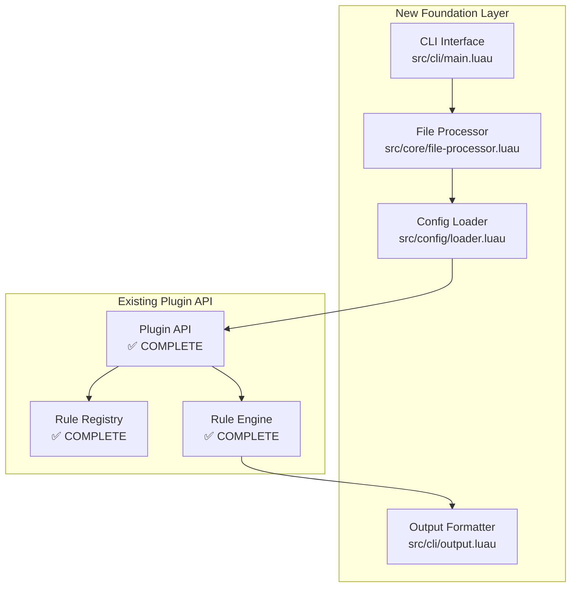

# Implementation Plan: Foundation Gap Recovery

This document provides a comprehensive implementation plan for the Luau Linter project, leveraging the completed Plugin API architecture while addressing the critical foundation gap that prevents basic functionality.

## Situation Analysis

### Current State Assessment
- **✅ Plugin API Architecture**: 100% complete with world-class implementation
- **✅ Rule System**: Comprehensive listener pattern with rule batching
- **✅ Type Safety**: Full Luau type definitions and validation
- **✅ Testing Framework**: 35 passing tests with snapshot testing
- **❌ Foundation Layer**: Missing CLI, configuration, and file processing
- **❌ User-Facing Functionality**: No way to actually run the linter

### Strategic Challenge
We have built a sophisticated engine but no way to start it. The project needs a **Foundation Recovery** approach that:
1. Preserves the excellent Plugin API architecture
2. Builds operational foundations rapidly
3. Enables user validation and feedback
4. Maintains architectural quality standards

## Implementation Strategy

### Phase 1: Foundation Recovery (Immediate - 2-3 weeks)

#### Objective
Create a Minimum Viable Linter that demonstrates the Plugin API's capabilities and enables real-world usage.

#### Architecture Integration Approach



#### Task 1: CLI Interface Implementation
**Files**: `src/cli/main.luau`, `src/cli/args.luau`, `src/cli/output.luau`

**Core Implementation**:
```luau
-- src/cli/main.luau
local PluginAPI = require("../plugin/plugin-api")
local FileProcessor = require("../core/file-processor")
local ConfigLoader = require("../config/loader")

local function main(args: { string })
    -- 1. Parse arguments
    local config = ConfigLoader.load()
    local files = FileProcessor.discover(args)
    
    -- 2. Create linter with built-in rules
    local registry, engine = PluginAPI.createLinter(config.rules)
    
    -- 3. Process files and collect results
    local allResults = {}
    for _, file in files do
        local ast, sourceText = FileProcessor.parseFile(file)
        local result = engine.lintFile(ast, sourceText, file)
        table.insert(allResults, result)
    end
    
    -- 4. Output results
    OutputFormatter.printResults(allResults)
end
```

**Integration Points**:
- Direct usage of existing `PluginAPI.createLinter()`
- Leverage `engine.lintFile()` API
- Respect Plugin API result formats

#### Task 2: File Processing Pipeline
**Files**: `src/core/file-processor.luau`, `src/core/ast-integration.luau`

**Core Implementation**:
```luau
-- src/core/file-processor.luau
local luau = require("@lute/luau")
local fs = require("@lute/fs")

local function parseFile(filepath: string): (any, string)
    local sourceText = fs.readFile(filepath)
    local ast = luau.parse(sourceText, filepath)
    return ast, sourceText
end

local function discoverFiles(paths: { string }): { string }
    -- Recursive .luau file discovery
    -- Basic filtering (.git/, node_modules/ exclusion)
    -- Error handling for invalid paths
end
```

**Integration Strategy**:
- Use Lute's `@lute/luau` parser directly
- Ensure AST format matches Plugin API expectations
- Validate with existing engine test cases

#### Task 3: Configuration System
**Files**: `src/config/loader.luau`, `src/config/defaults.luau`

**Core Implementation**:
```luau
-- src/config/loader.luau
local toml = require("@batteries/toml")

local function loadConfig(): ConfigType
    local config = {
        rules = getBuiltInRules(), -- Default built-in rules
    }
    
    -- Override with luau-lint.toml if present
    if fs.exists("luau-lint.toml") then
        local userConfig = toml.parse(fs.readFile("luau-lint.toml"))
        -- Merge user config with defaults
    end
    
    return config
end
```

**Integration Points**:
- Work with `PluginAPI.createLinter(rules)` signature
- Support `registry.setRuleEnabled()` for rule control
- Validate configuration against Plugin API schemas

### Phase 2: Built-in Rules & Validation (Short-term - 2-3 weeks)

#### Objective
Implement essential rules using the Plugin API to provide immediate value and validate the architecture.

#### Rule Implementation Strategy

**Priority Rules**:
1. **unused-variables** - Demonstrates variable scope tracking
2. **undefined-variables** - Shows cross-reference capabilities  
3. **modern-iteration** - Ports existing POC to listener pattern
4. **naming-conventions** - Validates configurable options

**Example Implementation**:
```luau
-- src/rules/unused-variables.luau
local PluginAPI = require("../plugin/plugin-api")

local unusedVariablesRule = PluginAPI.createRule({
    id = "unused-variables",
    title = "Disallow unused variables", 
    description = "Variables that are declared but never used",
    category = "logical",
    fixable = "auto",
    
    create = function(context)
        local declaredVars = {}
        local usedVars = {}
        
        return {
            LocalDeclaration = function(node)
                -- Track variable declarations
            end,
            
            Identifier = function(node)
                -- Track variable usage
            end,
            
            Program = {
                exit = function(node)
                    -- Report unused variables at end
                    for varName, decl in declaredVars do
                        if not usedVars[varName] then
                            context:report({
                                message = `Variable '{varName}' is declared but never used`,
                                node = decl,
                                fix = context:createFix(decl.range, "")
                            })
                        end
                    end
                end
            }
        }
    end
})
```

#### Performance Validation
- Test rule batching with 20+ rules on medium projects
- Validate single-pass traversal efficiency
- Measure Plugin API overhead vs. theoretical performance

### Phase 3: Production Readiness (Medium-term - 4-6 weeks)

#### Advanced Configuration System
- Hierarchical configuration (project, user, global)
- Rule option schemas and validation
- Configuration inheritance and overrides

#### Auto-fix Engine Enhancement
- Extend existing `context:createFix()` infrastructure
- Conflict resolution for overlapping fixes
- Batch fix application with validation

#### Performance Optimization
- AST caching for unchanged files
- Parallel file processing using Lute's task system
- Memory optimization for large projects

## Integration Challenges & Solutions

### Challenge 1: AST Format Compatibility
**Issue**: Lute's AST format may not match Plugin API expectations
**Solution**: 
- Create AST adapter layer in `ast-integration.luau`
- Validate with existing Plugin API test cases
- Maintain compatibility through wrapper functions

### Challenge 2: Error Handling Consistency
**Issue**: Foundation layer needs to match Plugin API error patterns
**Solution**:
- Use `@batteries/result` consistently throughout
- Leverage existing `LintError` types from Plugin API
- Maintain error isolation principles

### Challenge 3: Performance Integration
**Issue**: File processing may introduce performance bottlenecks
**Solution**:
- Benchmark end-to-end workflow against Plugin API alone
- Optimize file I/O and parsing operations
- Validate rule batching efficiency in real-world scenarios

## Quality Assurance Strategy

### Testing Approach
1. **Unit Tests**: Test each foundation component independently
2. **Integration Tests**: Validate Plugin API + Foundation interaction
3. **End-to-End Tests**: Complete CLI → output workflow testing
4. **Performance Tests**: Validate scalability claims

### Code Quality Standards
- Maintain Plugin API's strict Luau typing
- Use `@batteries/result` for error handling
- Follow Plugin API's documentation patterns
- Preserve TDD discipline from Plugin API work

### Validation Criteria
- ✅ CLI successfully lints real Luau projects
- ✅ Plugin API rules execute without modification
- ✅ Performance meets basic targets (100+ files, <10s)
- ✅ Error handling prevents crashes
- ✅ Configuration enables rule customization

## Risk Mitigation

### Technical Risks
1. **Plugin API Integration Issues**
   - Mitigation: Early integration testing, minimal API surface changes
   - Fallback: Adapter layers to maintain compatibility

2. **Lute Runtime Limitations**
   - Mitigation: Validate file system and parsing capabilities early
   - Fallback: Platform-specific implementations if needed

3. **Performance Degradation**
   - Mitigation: Continuous benchmarking throughout development
   - Fallback: Optimization sprints focused on bottlenecks

### Project Risks
1. **Scope Creep During Foundation Work**
   - Mitigation: Strict focus on MVP functionality
   - Acceptance: Defer advanced features to later phases

2. **Quality Regression from Rush**
   - Mitigation: Maintain Plugin API's quality standards
   - Validation: Code review and testing discipline

## Success Metrics

### Phase 1 Success Criteria
- [ ] Users can run `lute src/cli/main.luau src/` successfully
- [ ] Basic rule execution works end-to-end
- [ ] Configuration file controls rule behavior
- [ ] Error handling provides useful feedback
- [ ] Performance is acceptable for small projects

### Phase 2 Success Criteria  
- [ ] 5+ built-in rules demonstrate Plugin API capabilities
- [ ] Rule batching efficiency validated in practice
- [ ] Real Luau projects can be linted successfully
- [ ] User experience is intuitive and helpful

### Phase 3 Success Criteria
- [ ] Production-ready performance (1000+ files, 200+ rules)
- [ ] Advanced configuration supports organizational needs
- [ ] Auto-fix system works reliably
- [ ] Distribution and installation are straightforward

This implementation plan provides a clear, tactical path to transform the excellent Plugin API architecture into a functional, user-facing linter while preserving the quality and design principles that make the existing work exceptional.